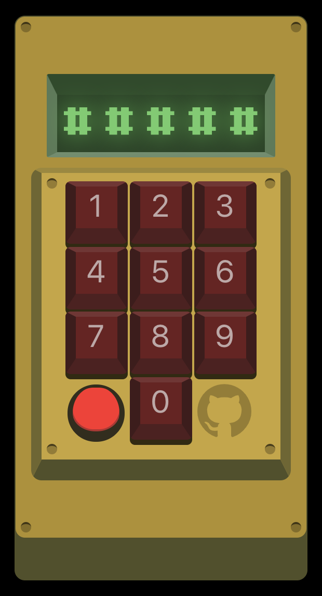

# Time Machine

This is a time machine that I created for a lightning talk I did on progressive web apps. The slides for that talk can be found here:

https://docs.google.com/presentation/d/1EhBWG6AW7zsSC96Yyu72RzDEizw-wMHD18Tg-J-b20c/edit?usp=sharing

You can try out the Time Machine here:
https://dreamy-panini-e7b6c2.netlify.com/

The time machine was built in react and all graphics are created using divs and css styling. The only image I used was the github logo.

## Travel through time
Turn on the time machine and try this code: 10101.

This is a progressive web app, so try it on your phone! It works especially well on Android devices when saved to your home screen.

### BEWARE! Time travel causes a physical side effect. You've been warned.

## Future functionality
I would like to implement keyboard key presses for the buttons when I have more time and add more time travel years.
